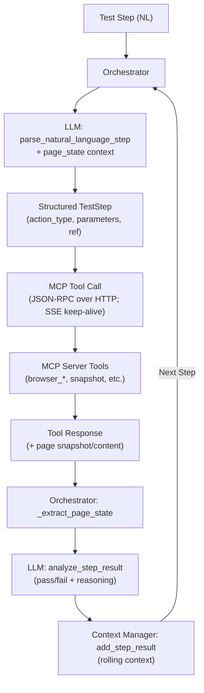

## Playwright MCP Test Orchestrator

This repository contains a test orchestration system that uses Playwright’s Model Context Protocol (MCP) tools and an LLM to execute natural-language test steps against the browser.

### Highlights
- Natural language → browser actions via LLM
- Persistent MCP connection (SSE + HTTP JSON-RPC) with rich snapshots
- Interactive and automated test flows
- Clean Python project template (formatting, linting, tests)

---

## Quick Start

```bash
# Create and activate a virtual environment (optional)
python -m venv venv
source venv/bin/activate  # macOS/Linux; on Windows: .\venv\Scripts\activate

# Install dev tools
pip3 install -r requirements.txt

# Install orchestrator/client dependencies
pip3 install -r mcp-client/requirements.txt
```

Set environment variables:
```bash
export OPENAI_API_KEY=your_key_here
export MCP_SERVER_URL=http://localhost:8000  # default
```

Verify everything works:
```bash
python mcp-client/test_orchestrator.py test-connection
```

---

## Usage (Test Orchestrator CLI)

All commands run from the repo root.

```bash
# Important quick run (from mcp-client):
# python test_orchestrator.py --llm-model gpt-4o run --test-file tests/sample.txt

# Verify connections (MCP + LLM)
python mcp-client/test_orchestrator.py test-connection

# Automated run (two quoted args)
python mcp-client/test_orchestrator.py run "Verify site loads" "Navigate to example.com"

# From a test file (repo root)
python mcp-client/test_orchestrator.py --llm-model gpt-4o run -f mcp-client/tests/sample.txt

# Interactive session
python mcp-client/test_orchestrator.py interactive "Explore" "Open homepage"

# Single step
python mcp-client/test_orchestrator.py single-step "Navigate to github.com and click Sign in"
```

Common options:
- `--mcp-server-url <URL>` (default `http://localhost:8000`)
- `--openai-api-key <KEY>`
- `--llm-model <MODEL>` (default `gpt-4`; e.g., `gpt-4o`)
- `--max-steps <N>` (default 50), `--step-timeout <seconds>` (default 30)
- `-v/--verbose`

Logging:
- Add `--report-file mcp-client/reports/run.json` to write a full JSON session log (LLM, JSON-RPC, SSE, tool calls, snapshots, step results).

---

## Available Browser Automation Tools

Navigation & Interaction:
- `browser_navigate`, `browser_click`, `browser_type`, `browser_press_key`, `browser_hover`, `browser_drag`

Browser Control:
- `browser_tab_new`, `browser_tab_select`, `browser_tab_close`, `browser_resize`, `browser_close`

Observation & Validation:
- `browser_snapshot`, `browser_take_screenshot`, `browser_console_messages`, `browser_network_requests`, `browser_wait_for`

---

## Commands

See `commands.md` for a full command reference, including orchestrator CLI, client utilities, Jenkins integration, and troubleshooting.

---

## Architecture

### High-level flow

```text
1) Test Step → Orchestrator
2) Orchestrator → LLM (parse_natural_language_step + previous page_state)
3) LLM → Structured Output (TestStep with action_type, parameters, ref)
4) Orchestrator → MCP Tool Call (call_tool with parameters)
5) MCP → Tool Response (with actual browser content + page snapshot)
6) Orchestrator → Extract Page State (_extract_page_state from response)
7) Orchestrator → LLM Analysis (analyze_step_result to determine pass/fail)
8) Orchestrator → Update Context (add step result to context manager)
9) LOOP: Next step uses updated page_state and context
```

### Diagram



### Key components and protocols

- JSON-RPC over HTTP: The orchestrator sends JSON-RPC requests to the MCP server using an HTTP POST. Responses may arrive as standard JSON or as the first event on a server-sent events (SSE) stream. A persistent SSE connection is maintained for efficient server communication and notifications.
- MCP Server and Tools: The MCP server exposes browser automation tools (e.g., `browser_navigate`, `browser_click`, `browser_snapshot`) that the orchestrator calls with structured parameters.
- LLM Role: The LLM converts natural-language steps into structured tool calls and evaluates tool responses to produce pass/fail judgments and reasoning. It also suggests the next step based on the rolling context and current page state.
- Context and Page State: The orchestrator extracts a page_state from tool responses and maintains a rolling context (via a context manager). Each loop iteration uses this updated context and page_state to improve the next step.

---

## Configuration

Environment variables:
- `OPENAI_API_KEY` (required)
- `MCP_SERVER_URL` (default `http://localhost:8000`)

Example (macOS/Linux):
```bash
export OPENAI_API_KEY=your_key_here
export MCP_SERVER_URL=http://localhost:8000
```

---

## Development

- Run tests: `pytest`
- Format code: `black .`
- Lint code: `flake8`

---

## Project Structure

```
playwright-mcp/
├── mcp-client/
│   ├── orchestrator/               # Orchestrator core (LLM, MCP client, context)
│   ├── test_orchestrator.py        # CLI entry for orchestrator
│   ├── README.md                    # Orchestrator overview
│   └── ORCHESTRATOR_README.md       # Detailed usage and docs
├── src/                             # Template app code
├── tests/                           # Template tests
├── commands.md                      # Command reference (repo-wide)
└── README.md                        # This file
```

---

## Troubleshooting

- Multiple tabs opening or stuck browser sessions:
  - See `commands.md` → “Troubleshooting: Kill lingering MCP/Playwright Chrome profiles”.

---

## Contributing

1. Create a feature branch
2. Run formatter and linter before committing
3. Add tests where applicable

---

## License

MIT 